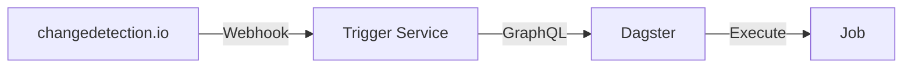
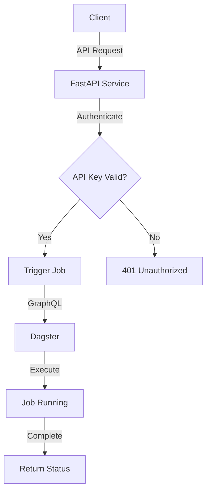

# 🎯 Dagster Job Trigger Service

<div align="center">

A FastAPI service to trigger Dagster jobs via REST API, designed for integration with change detection services.

[](https://github.com/ali2kan/sira-dagster-fastapi-client/actions/workflows/docker-build.yml)
[](https://github.com/ali2kan/sira-dagster-fastapi-client/actions/workflows/test.yml)
[](https://opensource.org/licenses/MIT)

</div>

## 🌟 Overview

This service provides secure REST endpoints to trigger Dagster jobs via GraphQL API, primarily used with [changedetection.io](https://changedetection.io/) to update databases when external data sources change.



## ✨ Features

- 🔐 Secure job triggering with API key authentication
- 🏥 Health check endpoint
- ⚡ Async job execution
- 🛡️ Comprehensive error handling and logging
- 🔄 Integration with changedetection.io

## ⚙️ Configuration

### Environment Variables

```bash
DAGSTER_HOST=10.10.10.34
DAGSTER_PORT=3000
DAGSTER_TIMEOUT_SECONDS=30
REPOSITORY_LOCATION=dlt_pipelines    # Dagster repository location
REPOSITORY_NAME=__repository__       # Dagster repository name
API_KEY=your_secret_key    # API key for authentication
```

### System Architecture



### Adding New Jobs

1. Edit `trigger_service/config.py` and add your job to `AVAILABLE_JOBS`:

```python
AVAILABLE_JOBS = {
    "countries_job": {
        "description": "Update countries database from external source",
        "repository_location": "dlt_pipelines",
        "repository_name": "__repository__",
    },
    "your_new_job": {
        "description": "Description of what this job does",
        "repository_location": "custom_location",  # Optional
        "repository_name": "custom_repo",         # Optional
    },
}
```

## 🚀 Installation

### Using Docker (Recommended)

```bash
# Build the image
docker build -t dagster-trigger .

# Run the container
docker run -d \
  --name dagster-trigger \
  -p 8000:8000 \
  -e DAGSTER_HOST=your_dagster_host \
  -e DAGSTER_PORT=your_dagster_port \
  -e API_KEY=your_secret_key \
  dagster-trigger
```

### Manual Installation

```bash
# Create virtual environment
python -m venv venv
source venv/bin/activate  # or `venv\Scripts\activate` on Windows

# Install dependencies
pip install -r requirements.txt

# Run the service
uvicorn trigger_service.trigger:app --host 0.0.0.0 --port 8000
```

## 🔌 API Usage

### Authentication Methods

| Method | Description | Example |
|--------|-------------|---------|
| Header | Use X-API-Key header | `X-API-Key: your_api_key` |
| URL Param | Include in query string | `?api_key=your_api_key` |

### API Endpoints

#### 🏥 Health Check

```bash
curl http://localhost:8000/health
```

#### 🎯 Trigger Job

```bash
curl -X POST http://localhost:8000/trigger/countries_job -H "X-API-Key: your_api_key"
# or
curl -X POST "http://localhost:8000/trigger/countries_job?api_key=your_api_key"
```

### 🔄 Integration with changedetection.io

1. Set up [changedetection.io](https://changedetection.io/) to monitor your data source
2. Configure a webhook notification:
   - URL: `http://your-service:8000/trigger/your_job_name?api_key=your_api_key`
   - Method: POST
   - Content Type: application/json

Example changedetection.io configurations:

#### Monitor REST API

```yaml
url: https://api.example.com/data
notification_urls:
  - http://localhost:8000/trigger/countries_job?api_key=your_api_key
```

#### Monitor Web Page

```yaml
url: https://example.com/data-page
notification_urls:
  - http://localhost:8000/trigger/countries_job?api_key=your_api_key
```

## 🔍 Dagster GraphQL Integration

The service uses Dagster's GraphQL API to trigger jobs. Here's how to find the correct parameters for your setup:

### 1. Query Repository Information

Use this query to find your repository location and name:

```graphql
query RepositoriesQuery {
  repositoriesOrError {
    ... on RepositoryConnection {
      nodes {
        name
        location {
          name
        }
      }
    }
  }
}
```

### 2. Query Pipeline Runs

To see existing runs and their configuration:

```graphql
query PaginatedPipelineRuns {
  pipelineRunsOrError {
    __typename
    ... on PipelineRuns {
      results {
        runId
        pipelineName
        status
        runConfigYaml
        repositoryOrigin {
          repositoryLocationName
          repositoryName
          __typename
          id
        }
        stats {
          ... on PipelineRunStatsSnapshot {
            startTime
            endTime
            stepsFailed
          }
        }
      }
    }
  }
}
```

### 3. Launch Run Mutation

The service uses this mutation to trigger jobs:

```graphql
mutation LaunchRunMutation(
  $repositoryLocationName: String!
  $repositoryName: String!
  $jobName: String!
  $runConfigData: RunConfigData!
  $tags: [ExecutionTag!]
) {
  launchRun(
    executionParams: {
      selector: {
        repositoryLocationName: $repositoryLocationName
        repositoryName: $repositoryName
        jobName: $jobName
      }
      runConfigData: $runConfigData
      executionMetadata: { tags: $tags }
    }
  ) {
    __typename
    ... on LaunchRunSuccess {
      run {
        runId
      }
    }
    ... on RunConfigValidationInvalid {
      errors {
        message
        reason
      }
    }
    ... on PythonError {
      message
    }
  }
}
```

Example variables for launching a job:

```json
{
  "runConfigData": "{}",
  "repositoryLocationName": "dlt_pipelines",
  "repositoryName": "__repository__",
  "jobName": "countries_job",
  "pipelineName": "countries_job"
}
```

## 👩‍💻 Development

### Project Structure

```
trigger_service/
├── __init__.py
├── config.py      # Configuration settings
├── trigger.py     # Main FastAPI application
└── utils.py       # Optional utilities
```

### Adding New Features

1. Update configuration in `config.py`
2. Add new endpoints in `trigger.py`
3. Update tests if applicable
4. Update documentation

### Testing

```bash
# Run tests
pytest

# Check code style
flake8 trigger_service
```

## 📊 Monitoring

### Logs

Docker logs can be viewed with:

```bash
docker logs -f dagster-trigger
```

### Metrics

Access FastAPI metrics at `/metrics` endpoint (if enabled).

## 🔧 Troubleshooting

Common issues and solutions:

| Issue | Solution |
|-------|----------|
| 🔌 Connection Refused | Check if Dagster is running and verify DAGSTER_HOST/PORT |
| 🔍 Job Not Found | Verify job name and repository configuration |
| ⏱️ Timeout Issues | Adjust DAGSTER_TIMEOUT_SECONDS |
| 🔑 Authentication Issues | Verify API_KEY configuration |

## 📚 References

- [Stack Overflow: Repository Location Name in Dagster](https://stackoverflow.com/questions/64752262/what-is-the-value-of-repositorylocationname-when-running-executepipeline-in-dag)
- [GitHub Discussion: Launching Dagster Jobs via GraphQL](https://github.com/dagster-io/dagster/discussions/21131)
- [Medium Article: Dagster GraphQL Integration](https://sairamkrish.medium.com/dagster-graphql-integration-35382c0f4bba)

## 🔒 Security Considerations

1. Use HTTPS in production
2. Configure CORS appropriately
3. Use environment variables for sensitive data
4. Protect API keys and sensitive configuration

## 📄 License

MIT License

## 🤝 Contributing

1. Fork the repository
2. Create a feature branch
3. Submit a pull request

## 💬 Support

Create an issue in the repository for:

- 🐛 Bug reports
- ✨ Feature requests
- ❓ General questions

---

<div align="center">

Made with ❤️ by ali2kan

</div>
